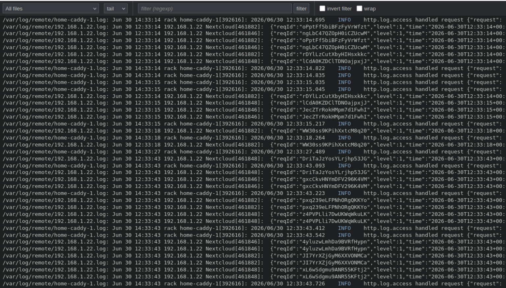

<p align="center">
  
</p>

# Tailon

[](https://goreportcard.com/report/github.com/tbocek/tailon)
[](https://github.com/tbocek/tailon/blob/main/LICENSE)

> **This is a fork of [gvalkov/tailon].** It keeps the purpose — tail and grep your
> log files from the browser — but rebuilds the project around the Go standard
> library alone: **zero third-party dependencies**, no JavaScript toolchain, and a
> single static binary. [How this fork differs from the original](#how-this-fork-differs-from-the-original)
> spells out exactly what changed and why you might pick it over upstream.

Tailon is a webapp for looking at and searching through log files from your
browser. It serves files — single files, globs or whole directories — and lets
you **tail** them live or **grep** through them, with a regular-expression
filter (which can be inverted). Reading, following and filtering are all done
natively in Go: tailon never shells out to `tail`, `grep` or any other tool, and
it has **no dependencies** — just the Go standard library, shipped as a single
static binary.

## How this fork differs from the original

The "original" here is **[gvalkov/tailon]**, the Go project this repository was
forked from — *not* the older Python [tailon-legacy] (see [Project
lineage](#project-lineage)). Same job, far less machinery:

| Area | [gvalkov/tailon] (upstream) | This fork |
| --- | --- | --- |
| Third-party dependencies | Vue.js, SockJS, build-time tooling | **None** — Go standard library only |
| Frontend | Vue.js single-page app | Framework-free vanilla HTML/CSS/JS |
| Live updates | SockJS | Server-Sent Events |
| Frontend assets | produced by a code-generation/build step | embedded with `//go:embed`, no build step |
| Configuration | configuration file | command-line flags only |
| Releases | GoReleaser | a small [`release.sh`](release.sh) + GitHub Actions |
| Tests | Python integration tests | Go unit tests (`go test ./...`) |

The result is a smaller, self-contained binary you can read and audit in one
sitting — no Node/npm, no asset pipeline, nothing to vendor. Prefer the original's
Vue UI and configuration-file setup? Use [gvalkov/tailon]. Want a tiny,
dependency-free log tailer? Use this.

## Install

Install the latest release binary for your OS and architecture (Linux and
macOS, Intel and Apple Silicon). The script installs to `/usr/local/bin`, or
`~/.local/bin` when that isn't writable:

```
curl -sL https://raw.githubusercontent.com/tbocek/tailon/main/install.sh | bash
```

Or install from source with Go (1.26+):

```
go install github.com/tbocek/tailon@latest
```

Prebuilt binaries are also attached to every entry on the [releases] page.

## Usage

Each file can be viewed in two modes — **tail** (follow the file live, like
`tail -f`) or **grep** (read the whole file from the start) — and narrowed with
an optional regular-expression **filter** that can be inverted (both set in the
UI). Tailon itself is configured entirely with command-line flags.

To get started, run tailon with the files or directories you want to monitor.
Each argument is a file, a directory, or a shell glob — `*` matches within a
directory and `**` across them — and a single argument can list several,
comma-separated:

```
tailon /var/log/apache/access.log /var/log/apache/error.log /var/log/messages
tailon /var/log/apache/,/var/log/nginx/
tailon "/var/log/**.log"
```

Directories are served recursively — every file beneath them (including in
subdirectories) is available, and new files are picked up as they appear. The
file selector also lists each subfolder, so you can tail or grep just the logs
beneath one of them.

The web UI's file selector includes an **All files** entry (selected by default)
that streams every served file at once, each line prefixed by its file and the
streams **merged in timestamp order**. Several common formats are recognized at
(or near) the start of each line — ISO 8601 / RFC 3339, `YYYY-MM-DD HH:MM:SS`,
slash-separated dates, Apache/CLF, Unix `ctime` and syslog (RFC 3164). The format
is detected per file from its first lines (not guessed from a single one), and a
line without a recognizable timestamp keeps its file's previous one, so
multi-line entries stay together. Handy when you're watching logs from many
hosts together.

### Example: central syslog server

A common deployment is a host that aggregates logs from many machines via
[syslog-ng] (or rsyslog) into a directory tree such as `/var/log/remote`. Point
tailon at the directory to serve everything under it recursively:

```
tailon /var/log/remote/
```

Every file beneath it — including per-host subdirectories — shows up in the file
picker, and **All files** streams them all merged in timestamp order.

Tailon's server-side functionality is summarized entirely in its help message:

[//]: # (run "./tailon --help" to update the next section)

[//]: # (BEGIN HELP_USAGE)
```
Usage: tailon [options] <path> [<path> ...]

Tailon is a webapp for searching through log files from your browser.

  -b, --bind string            Address and port to listen on (default ":8080")
  -h, --help                   Show this help message and exit
  -r, --relative-root string   Webapp relative root (default "/")

Tailon is configured entirely through command-line flags.

Each <path> is a file, a directory, or a shell glob, where "*" matches within a
directory and "**" across them (so "/var/log/**.log" finds .log files at any
depth). Directories are served recursively, and new files are picked up as they
appear. Several paths can be given as separate arguments or comma-separated.

Example usage:
  tailon /var/log/syslog /var/log/auth.log
  tailon /var/log/nginx/,/var/log/apache/
  tailon /var/log/remote/
  tailon "/var/log/**.log"
  tailon -b 127.0.0.1:8080 /var/log/messages
```
[//]: # (END HELP_USAGE)

## Security

Tailon does not run external commands or invoke a shell. The filter is a Go
([RE2]) regular expression applied in-process, so there is no risk of shell or
command injection from anything entered in the UI.

Tailon serves — and lets clients download — exactly the files you point it at on
the command line. It performs no
authentication: by default it is reachable by anyone who can connect to its
address and port. Restrict the bind address or put it behind an authenticating
reverse proxy if that matters for your deployment.

## Development

### Frontend

The frontend is plain, framework-free HTML, CSS and JavaScript. The static
assets live in `frontend/dist` and the Go templates in `frontend/templates`;
both are embedded into the binary at compile time with `//go:embed` (see
`frontend.go`). There is no build step or toolchain — edit the files directly
and rebuild the binary. The UI talks to the backend over Server-Sent Events.

### Backend

The backend is written in straightforward Go using **only the standard library** —
there are no third-party dependencies. Flag parsing, configuration, HTTP serving,
access logging, file following and regexp filtering for the Server-Sent Events
stream are all standard library. File reading and following live in `tailer.go`.

### TODO

* Basic and digest authentication.

* Add a 'command' filespec - e.g. `"command,journalctl -u nginx"`.

* Better configuration dialog.

* Add interface themes - e.g. light, dark and solarized.

* Add ability to change font family and size.

* Windows support (can use one of the Go tail implementations).

* Implement [wtee].

* Support ANSI color codes.

### Testing

Run the unit tests with `go test ./...`.

## Project lineage

Three distinct projects have carried the **tailon** name; this is the third, and
the source of the recurring "wait, which tailon?" confusion:

1. **[tailon-legacy]** — the first one, written in Python + Tornado with a custom
   TypeScript frontend.
2. **[gvalkov/tailon]** — a full rewrite in Go with a Vue.js + SockJS frontend,
   configured through a file and released with GoReleaser. **This is the upstream
   this repository is forked from.**
3. **This fork** — drops the third-party frontend and tooling for a
   framework-free, dependency-free, single static binary. See [How this fork
   differs from the original](#how-this-fork-differs-from-the-original) for the
   point-by-point comparison.

## Similar Projects

* [clarity]
* [errorlog]
* [log.io]
* [rtail]
* [tailon-legacy]

Attributions
------------

Tailon's favicon was created from [this icon].

## License

Tailon is released under the terms of the [Apache 2.0 License].

[gvalkov/tailon]: https://github.com/gvalkov/tailon
[tailon-legacy]:  https://github.com/gvalkov/tailon-legacy
[syslog-ng]:      https://www.syslog-ng.com/
[clarity]:        https://github.com/tobi/clarity
[wtee]:           https://github.com/gvalkov/wtee
[releases]:       https://github.com/tbocek/tailon/releases
[errorlog]:       http://www.psychogenic.com/en/products/Errorlog.php
[log.io]:         http://logio.org/
[rtail]:          http://rtail.org/
[this icon]:      http://www.iconfinder.com/icondetails/15150/48/terminal_icon
[RE2]:            https://github.com/google/re2/wiki/Syntax
[Apache 2.0 License]: LICENSE
